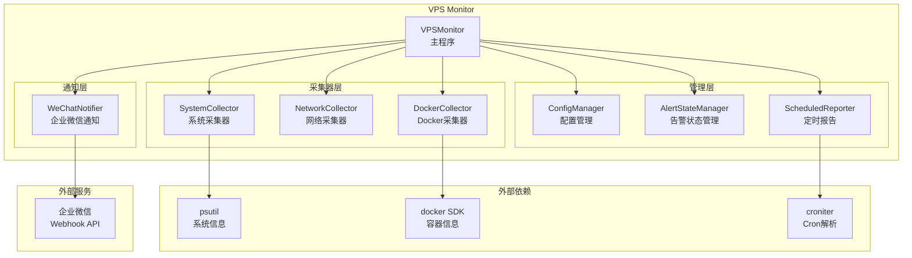

# VPS Monitor - AI 上下文索引

> **项目**: VPS 监控系统
> **版本**: v1.0
> **更新时间**: 2026-02-04

---

## 项目概述

VPS Monitor 是一个轻量级的 VPS 服务器监控系统，使用 Python 开发，支持实时监控系统资源（CPU、内存、磁盘、Swap、网络）和 Docker 容器状态，通过企业微信机器人发送告警通知和定时状态报告。

### 核心功能

- **系统资源监控**: CPU、内存、磁盘、Swap 使用率
- **网络监控**: 流量速率、连接数
- **Docker 监控**: 容器运行状态、健康检查
- **告警通知**: 企业微信机器人，支持告警冷却和恢复通知
- **定时报告**: 基于 Cron 表达式的定时状态推送
- **服务化部署**: systemd 服务，开机自启

---

## 架构概览



---

## 技术栈

| 组件 | 技术 | 版本要求 |
|------|------|----------|
| 运行时 | Python | >= 3.9 |
| 系统监控 | psutil | >= 5.9.0 |
| Docker 监控 | docker SDK | >= 6.0.0 |
| 配置管理 | PyYAML | >= 6.0 |
| HTTP 请求 | requests | >= 2.28.0 |
| 定时任务 | croniter | >= 1.3.0 |
| 服务管理 | systemd | Linux 系统 |

---

## 项目结构

```
/home/venom/workspace/vps-monitor/
├── monitor.py              # 主程序（单文件架构）
├── config.yaml             # 配置文件模板
├── requirements.txt        # Python 依赖
├── vps-monitor.service     # systemd 服务配置
├── install.sh              # 安装脚本
├── uninstall.sh            # 卸载脚本
├── README.md               # 用户文档
├── CLAUDE.md               # AI 上下文索引（本文件）
├── .gitignore              # Git 忽略规则
├── .claude/
│   └── plans/
│       └── vps-monitor-implementation-plan.md  # 实现计划
└── logs/                   # 日志目录（运行时生成）
```

---

## 核心模块说明

### monitor.py - 主程序（单文件架构）

所有核心逻辑集中在单个 Python 文件中，包含以下类：

| 类名 | 行号范围 | 职责 |
|------|----------|------|
| `ConfigManager` | 41-131 | 加载和验证 YAML 配置，提供默认值合并 |
| `WeChatNotifier` | 138-269 | 企业微信 Webhook 消息发送，支持告警/恢复/报告 |
| `AlertStateManager` | 276-329 | 告警状态持久化，冷却时间检查，去重逻辑 |
| `SystemCollector` | 336-456 | 采集 CPU/内存/磁盘/Swap，阈值检查 |
| `NetworkCollector` | 463-551 | 采集网络流量和连接数，速率计算 |
| `DockerCollector` | 558-675 | Docker 容器状态和健康检查 |
| `ScheduledReporter` | 682-731 | Cron 表达式解析，定时报告触发 |
| `VPSMonitor` | 738-924 | 主程序，整合所有组件，运行监控循环 |

### 关键入口点

- **主函数**: `main()` (行 931-947)
- **监控循环**: `VPSMonitor.run()` (行 900-924)
- **单次检查**: `VPSMonitor.run_once()` (行 875-898)

---

## 配置说明

配置文件 `config.yaml` 结构：

```yaml
general:           # 基础配置
  hostname: ""     # 主机名（空则自动获取）
  check_interval: 900    # 检查间隔（秒）
  alert_cooldown: 300    # 告警冷却（秒）
  send_recovery: true    # 发送恢复通知
  log_level: "INFO"      # 日志级别

wechat:            # 企业微信配置
  webhook_url: ""  # Webhook URL

system:            # 系统监控配置
  memory/disk/cpu/swap:
    enabled: true
    threshold: 80  # 阈值百分比

network:           # 网络监控配置
  traffic:
    threshold_mbps: 100
  connections:
    threshold: 1000

docker:            # Docker 监控配置
  enabled: true
  containers: []   # 容器列表

scheduled_report:  # 定时报告配置
  enabled: true
  cron: "0 9 * * *"
```

---

## 常用命令

### 开发调试

```bash
# 直接运行（开发模式）
python3 monitor.py

# 安装依赖
pip3 install -r requirements.txt
```

### 服务管理

```bash
# 安装服务
sudo ./install.sh

# 卸载服务
sudo ./uninstall.sh

# systemd 命令
sudo systemctl start vps-monitor
sudo systemctl stop vps-monitor
sudo systemctl restart vps-monitor
sudo systemctl status vps-monitor

# 查看日志
sudo journalctl -u vps-monitor -f
tail -f /opt/vps-monitor/logs/monitor.log
```

---

## 数据流

1. **监控循环**: `VPSMonitor.run()` 按 `check_interval` 间隔执行检查
2. **数据采集**: 各 Collector 调用 psutil/docker SDK 获取指标
3. **阈值判断**: 对比配置阈值，生成告警列表
4. **告警处理**:
   - 检查冷却时间（`AlertStateManager.should_alert()`）
   - 发送告警/恢复通知（`WeChatNotifier`）
   - 记录告警状态（持久化到 `alert_state.json`）
5. **定时报告**: `ScheduledReporter` 检查 Cron 时间，触发状态报告

---

## 运行时文件

| 文件 | 路径 | 说明 |
|------|------|------|
| 告警状态 | `alert_state.json` | 告警去重和冷却状态 |
| 日志文件 | `logs/monitor.log` | 应用日志 |

---

## 部署路径

生产环境安装路径: `/opt/vps-monitor/`

---

## 扫描覆盖率

| 指标 | 数值 |
|------|------|
| 扫描文件数 | 8 |
| 总源文件数 | 8 |
| 覆盖率 | 100% |
| 模块数 | 1（单文件架构） |

### 已扫描文件

- [x] `monitor.py` - 主程序
- [x] `config.yaml` - 配置模板
- [x] `requirements.txt` - 依赖
- [x] `vps-monitor.service` - systemd 服务
- [x] `install.sh` - 安装脚本
- [x] `uninstall.sh` - 卸载脚本
- [x] `README.md` - 用户文档
- [x] `.claude/plans/vps-monitor-implementation-plan.md` - 实现计划

### 忽略项

- `.git/` - Git 版本控制
- `__pycache__/` - Python 缓存
- `logs/` - 运行时日志
- `alert_state.json` - 运行时状态

---

## 开发注意事项

1. **单文件架构**: 所有核心代码在 `monitor.py`，便于部署但需注意代码组织
2. **可选依赖**: `docker` 和 `croniter` 为可选依赖，缺失时优雅降级
3. **权限要求**: 网络连接数采集需要 root 权限
4. **配置验证**: 启动时验证 Webhook URL 和 Cron 表达式
5. **告警冷却**: 默认 5 分钟冷却，避免告警风暴
